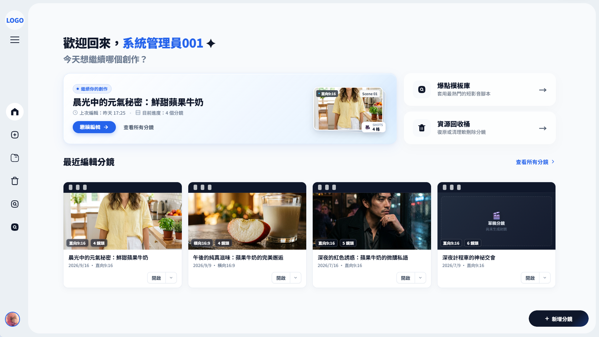
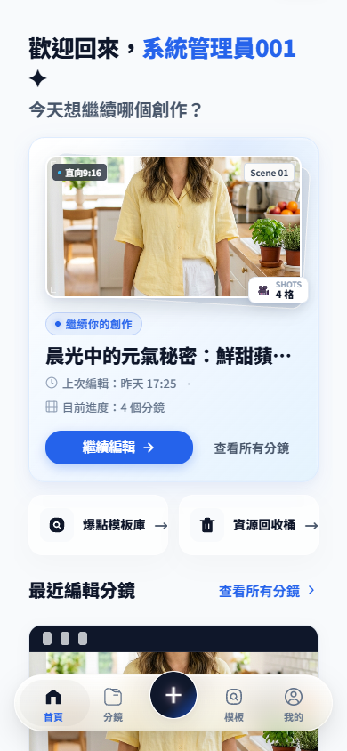
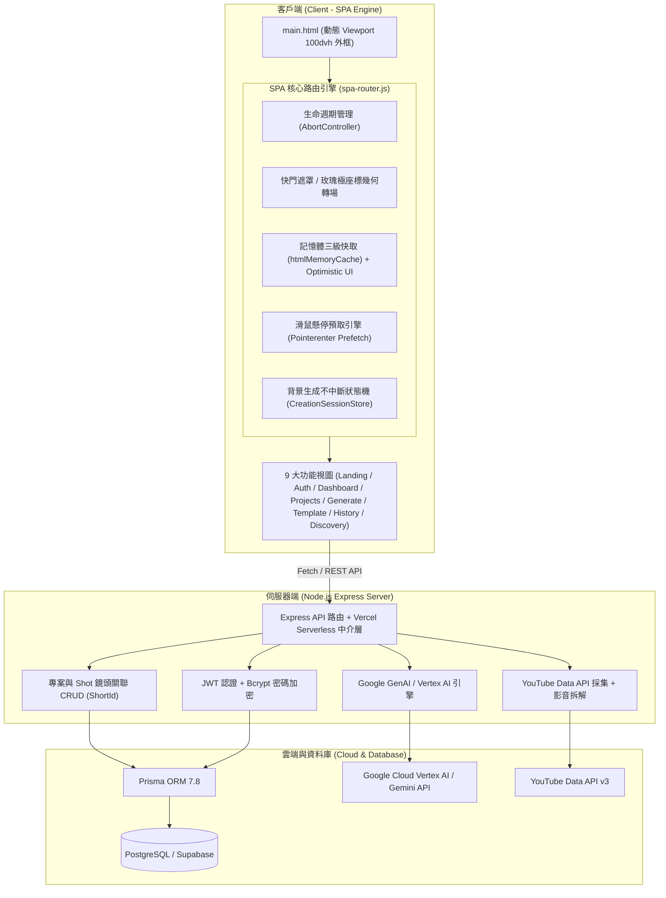
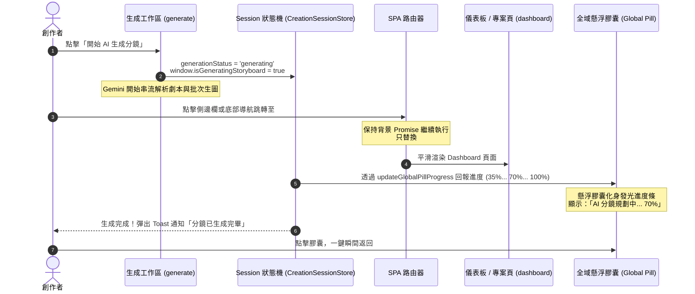
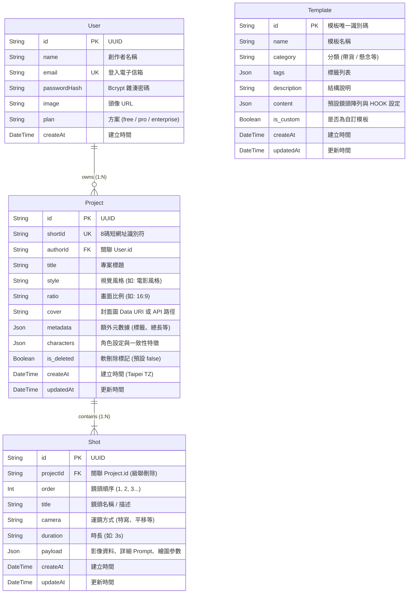

# 🎬 Storyboard AI — 智能短影音分鏡創作平台

<div align="center">


**「靈感，一鍵轉換」—— 專為新媒體創作者、導演與影視團隊打造的 AI 智能短影音分鏡創作與爆點分析系統**

<br>

<p align="center">
  
</p>

</div>

---

## 📸 系統視覺預覽 (UI Gallery & Screenshots)

<div align="center">

### 🖥️ 電腦端 (Desktop) vs 📱 手機端 (Mobile) 設計對照

<table>
  <tr>
    <th width="65%" align="center">🖥️ 電腦端主控儀表板 (Desktop Dashboard)</th>
    <th width="35%" align="center">📱 手機端立體壓克力體驗 (Mobile Experience)</th>
  </tr>
  <tr>
    <td align="center" valign="top">
      
      <br>
      <em>▲ 60px 迷你圖標側邊欄、35mm 物理膠卷卡片、焦點置頂專案與全局快速創作塢</em>
    </td>
    <td align="center" valign="top">
      
      <br>
      <em>▲ 立體磨砂壓克力浮島底部導航 (Bottom Nav)、雙軌剪裁遮罩與靈動跟手回彈</em>
    </td>
  </tr>
  <tr>
    <th align="center">🎬 品牌概念落地頁 (Landing Page)</th>
    <th align="center">🔐 膠卷美學身份認證 (Auth Portal)</th>
  </tr>
  <tr>
    <td align="center" valign="top">
      
      <br>
      <em>▲ 3D 電影打板機滾動視差合攏動畫、預告片展示與「靈感，一鍵轉換」主題入口</em>
    </td>
    <td align="center" valign="top">
      
      <br>
      <em>▲ 膠卷上下雙排齒孔卡片容器、雙標籤滑動切換與密碼眼睛動態顯示</em>
    </td>
  </tr>
</table>

</div>

---

## 📑 目錄

- [一、專案簡介 (Project Overview)](#一專案簡介-project-overview)
  - [1.1 核心理念與問題背景](#11-核心理念與問題背景)
  - [1.2 系統整體架構圖](#12-系統整體架構圖)
  - [1.3 技術棧一覽 (Tech Stack)](#13-技術棧一覽-tech-stack)
- [二、跨平台設計語言與終端細節 (Desktop & Mobile Design System)](#二跨平台設計語言與終端細節-desktop--mobile-design-system)
  - [2.1 電腦端設計細節：膠卷工業美學、側邊欄與軌道齒孔](#21-電腦端設計細節膠卷工業美學側邊欄與軌道齒孔)
  - [2.2 手機端設計細節：立體磨砂壓克力 Bottom Nav 與靈動跟手回彈](#22-手機端設計細節立體磨砂壓克力-bottom-nav-與靈動跟手回彈)
  - [2.3 雙軌剪裁遮罩技術 (Dual-Track Clip-Path Indicator)](#23-雙軌剪裁遮罩技術-dual-track-clip-path-indicator)
  - [2.4 虛擬鍵盤避讓與 Viewport 動態適配 (`100dvh` + VisualViewport)](#24-虛擬鍵盤避讓與-viewport-動態適配-100dvh--visualviewport)
- [三、極致 SPA 路由與底層工程 (SPA Engine & Performance)](#三極致-spa-路由與底層工程-spa-engine--performance)
  - [3.1 單頁式網頁替換：背景生成不中斷 (Continuous Generation)](#31-單頁式網頁替換背景生成不中斷-continuous-generation)
  - [3.2 懸停瞬開機制：滑鼠懸停快取 (Hover Prefetching Architecture)](#32-懸停瞬開機制滑鼠懸停快取-hover-prefetching-architecture)
  - [3.3 路由切換生命週期與非同步中斷 (`AbortController`)](#33-路由切換生命週期與非同步中斷-abortcontroller)
- [四、靈動動效與數學幾何 (Fluid Motion & Math Aesthetics)](#四靈動動效與數學幾何-fluid-motion--math-aesthetics)
  - [4.1 極座標玫瑰幾何載入動畫 (Rose Curve Loader)](#41-極座標玫瑰幾何載入動畫-rose-curve-loader)
  - [4.2 快速創作塢 (Quick Compose, QC) 形變動效](#42-快速創作塢-quick-compose-qc-形變動效)
  - [4.3 專案下墜入垃圾桶與 5 秒撤銷動畫 (Drop to Trash & Undo Toast)](#43-專案下墜入垃圾桶與-5-秒撤銷動畫-drop-to-trash--undo-toast)
  - [4.4 電影快門黑幕遮罩 (Black Mask Transition) 與深景深縮放](#44-電影快門黑幕遮罩-black-mask-transition-與深景深縮放)
  - [4.5 專案卡片 Option 按鈕物理形變動態 (Solid Matte Acrylic Option Morph)](#45-專案卡片-option-按鈕物理形變動態-solid-matte-acrylic-option-morph)
- [五、核心功能模塊 (Feature Modules)](#五核心功能模塊-feature-modules)
  - [5.1 身份認證與帳號安全模組 (Auth & Security)](#51-身份認證與帳號安全模組-auth--security)
  - [5.2 專案與分鏡管理模組 (Project & Storyboard Management)](#52-專案與分鏡管理模組-project--storyboard-management)
  - [5.3 四階段 AI 分鏡生成工作室 (AI Creation Studio & Engine)](#53-四階段-ai-分鏡生成工作室-ai-creation-studio--engine)
  - [5.4 爆點模板庫與時間軸模組 (Hook Templates & Timeline)](#54-爆點模板庫與時間軸模組-hook-templates--timeline)
  - [5.5 熱門短影音探索與拆解實驗室 (Discovery & Video Analysis Lab)](#55-熱門短影音探索與拆解實驗室-discovery--video-analysis-lab)
  - [5.6 資源回收與歷史防護 (History & Soft-Delete)](#56-資源回收與歷史防護-history--soft-delete)
- [六、頁面細分設計與基礎邏輯 (Pages Breakdown)](#六頁面細分設計與基礎邏輯-pages-breakdown)
  - [6.1 頁面 1：主外框與視窗動態適配頁 (`main.html` + `main.js`)](#61-頁面-1主外框與視窗動態適配頁-mainhtml--mainjs)
  - [6.2 頁面 2：品牌落地頁 (`index.html` + `landing.js`)](#62-頁面-2品牌落地頁-indexhtml--landingjs)
  - [6.3 頁面 3：身份認證頁面 (`login.html` + `auth.js`)](#63-頁面-3身份認證頁面-loginhtml--authjs)
  - [6.4 頁面 4：創作者主控儀表板 (`dashboard.html` + `dashboard.js`)](#64-頁面-4創作者主控儀表板-dashboardhtml--dashboardjs)
  - [6.5 頁面 5：分鏡專案庫與詳情檢視 (`projects.html`)](#65-頁面-5分鏡專案庫與詳情檢視-projectshtml)
  - [6.6 頁面 6：AI 核心分鏡生成工作區 (`generate.html` + `generate.js`)](#66-頁面-6ai-核心分鏡生成工作區-generatehtml--generatejs)
  - [6.7 頁面 7：爆點模板庫與時間軸預覽 (`template.html` + `template-timeline.js`)](#67-頁面-7爆點模板庫與時間軸預覽-templatehtml--template-timelinejs)
  - [6.8 頁面 8：資源回收桶 (`history.html`)](#68-頁面-8資源回收桶-historyhtml)
  - [6.9 頁面 9：短影音探索實驗室 (`discovery.html` + `discovery-settings.html`)](#69-頁面-9短影音探索實驗室-discoveryhtml--discovery-settingshtml)
- [七、資料庫結構與 API 規格 (Database & APIs)](#七資料庫結構與-api-規格-database--apis)
  - [7.1 Prisma Schema 實體關係圖](#71-prisma-schema-實體關係圖)
  - [7.2 核心 RESTful API 列表](#72-核心-restful-api-列表)
- [八、環境建置與部署指南 (Getting Started & Deployment)](#八環境建置與部署指南-getting-started--deployment)
  - [8.1 環境變數設定 (`.env`)](#81-環境變數設定-env)
  - [8.2 本地端啟動流程](#82-本地端啟動流程)
  - [8.3 雲端 / Vercel Serverless 部署注意事項](#83-雲端--vercel-serverless-部署注意事項)

---

## 一、專案簡介 (Project Overview)

### 1.1 核心理念與問題背景

在短影音（YouTube Shorts / TikTok / Instagram Reels）高頻競爭的時代，創作者與導演常面臨三大難題：
1. **前置劇本轉化耗時**：從文字構思到分鏡草圖往往需耗費數日，拖垮產出節奏。
2. **缺乏前 3 秒爆點 (HOOK)**：缺乏科學的短影音節奏編排，完播率與留存率難以突破。
3. **工作流割裂繁瑣**：靈感發想、腳本撰寫、運鏡設計、分鏡繪製與專案歸檔散落於不同工具。

**Storyboard AI** 結合劇本邏輯拆解、爆點模板庫與 Google 頂尖生成模型（Gemini 2.5 Flash Lite、Gemini 3.5 Flash 與 Gemini 3.1 Flash Image），提供全流程極致絲滑的單頁應用（SPA）創作環境。使用者只需提供一句靈感或一段故事，系統便會自動分析鏡頭語言（景別、運鏡、燈光、時間長度），並即時生成具備電影質感的專業分鏡劇本與高解析度畫面。

---

### 1.2 系統整體架構圖



---

### 1.3 技術棧一覽 (Tech Stack)

| 領域 | 技術項目 | 說明 |
| :--- | :--- | :--- |
| **前端核心** | 原生 Vanilla JavaScript (ES6+) | 零厚重框架包袱，毫秒級啟動，完全掌控 DOM 生命週期與記憶體管理 |
| **單頁路由** | 自研 SPA Router (`spa-router.js`) | Hash/History 雙向同步、動態注入 CSS/JS、多層快取與無損轉場 |
| **視圖適配** | Dynamic Viewport (`100dvh`) | 支援 iOS/Android 虛擬鍵盤彈起即時高度重算 (`VisualViewport` API) |
| **設計系統** | CSS Tokens v3.0 | 3-Layer Token 架構 (Primitives / Semantics / Components)，WCAG AA 認證 |
| **物理動效** | GSAP 3.14 + 彈簧力學數值積分 | 3D 打板機視差合攏、拖曳阻尼與過衝回彈 (Overshoot Rebound) |
| **後端核心** | Node.js + Express 5.x | RESTful API、Vercel Serverless 中介層、支援 100MB 大資料負載 |
| **資料持久化**| Prisma ORM 7.8 + PostgreSQL (`pg`) | 配合 `@prisma/adapter-pg` 連線池管理，支援 UUID 與 8 碼 ShortId |
| **身分驗證** | JWT (`jsonwebtoken`) + `bcrypt` | Bearer Token 傳輸、安全性密碼雜湊、過期自動倒退登入與快取重置 |
| **AI 模型整合**| Google GenAI SDK (`@google/genai`) | `gemini-2.5-flash-lite` (超低延遲)、`gemini-3.5-flash` (劇本拆解)、`gemini-3.1-flash-image` (1K 生圖) |
| **影音探索** | YouTube Data API v3 + 多模態分析 | 搜尋 Shorts 數據，多模態剖析前 3 秒爆點鉤子、轉場節奏與分鏡 |

---

## 二、跨平台設計語言與終端細節 (Desktop & Mobile Design System)

本專案針對電腦端與手機端的使用情境，制定了高度差異化但語意統一的雙端設計語言：

### 2.1 電腦端設計細節：膠卷工業美學、側邊欄與軌道齒孔

<p align="center">
  
</p>

1. **實體 35mm 膠卷齒孔 (Sprocket Holes & Rail Holes)**：
   - 專案卡片左側與全域軌道具備擬真 35mm 電影膠卷物理齒孔結構（`.card-strip` 搭配 `.strip-hole`）。
   - **動態齒孔計算 (`updateRailHoles`)**：視窗縮放時，系統透過 JavaScript 動態取得容器真實高度，以黃金比例精確計算並重新渲染等距齒孔數量，杜絕變形拉伸。
2. **雙態變形側邊欄 (Morphing Sidebar)**：
   - **收合模式 (60px)**：僅呈現高精度 SVG 圖標與外發光焦點；懸停時浮現深色 Tooltip。
   - **展開模式 (260px)**：平滑滑出文字標題、漢堡按鈕旋轉動畫、以及獨立展開的「分鏡子專案清單」（`#sidebar-projects-list`）。
   - **狀態持久記憶**：展開狀態自動記錄於 `localStorage.getItem('sidebar_projects_expanded')`，重新整理後精準還原。
3. **懸浮發光邊框 (Interactive Link Glow)**：
   - 側邊欄與各級功能卡片配置 `link-glow` 偽元素，隨游標懸停呈現電影黃金調（Gold）或深邃科技藍（Blue）光暈。

---

### 2.2 手機端設計細節：立體磨砂壓克力 Bottom Nav 與靈動跟手回彈

在螢幕寬度 $\le 768\text{px}$ 或直式螢幕（Portrait Mode）時，系統自動將電腦側邊欄銷毀隱藏，取而代之的是浮動於螢幕底部的**立體磨砂壓克力浮島導航列 (Mobile Bottom Nav)**。

<p align="center">
  
</p>

#### 1. 材質工藝 (Frosted Acrylic Material Spec)
- **多層漸層底色**：
  `background: linear-gradient(180deg, rgba(255, 255, 255, 0.62) 0%, rgba(245, 245, 240, 0.45) 100%) !important;`
- **超採樣背景模糊與飽和度提升**：
  `backdrop-filter: blur(12px) saturate(125%) brightness(1.04);`
- **表面高光微反光膜 (Surface Sheen Film)**：
  透過 `::before` 偽元素注入 `linear-gradient(180deg, rgba(255, 255, 255, 0.22) 0%, rgba(255, 255, 255, 0) 55%)`，呈現如高級壓克力邊緣的自然漫反射。

#### 2. 靈動跟手回彈與物理彈簧 (Rubberband Physics & Spring Dynamics)
- **指尖拖曳阻尼公式**：
  當使用者在導航列上拖曳時，X/Y 位移採用雙曲漸近阻尼演算法：
  $$\Delta x_{\text{render}} = \text{sign}(\Delta x) \cdot \text{maxDx} \cdot \left(1 - \frac{1}{1 + \frac{|\Delta x| \cdot 0.16}{\text{maxDx}}}\right)$$
- **方向性縱向拉伸 (Directional Vertical Stretch)**：
  若手指垂直拖曳超過 8px，膠囊會依據拖曳方向動態形變拉伸：
  $$\text{scaleY} = \text{baseScale} + \min(0.045, (|\Delta y| - 8) \times 0.0035)$$
- **離手物理彈簧數值積分 (Runge-Kutta / Euler Spring Step)**：
  放手瞬間啟動每秒 60/120fps 的物理微分方程數值迭代（$F = -kx - cv$）：
  ```javascript
  const posStiffness = isLargeDisplacement ? 380 : 320;
  const posDamping = isLargeDisplacement ? 12.5 : 24;
  const scaleStiffness = 360;
  const scaleDamping = 22;

  function springStep(now) {
    const dt = Math.min(0.032, (now - lastTime) / 1000);
    const ax = -posStiffness * curX - posDamping * vx;
    const ay = -posStiffness * curY - posDamping * vy;
    vx += ax * dt;
    vy += ay * dt;
    curX += vx * dt;
    curY += vy * dt;
    // 產生極度細緻的 iOS 級別過衝回彈 (Overshoot Rebound)
  }
  ```
- **磁吸觸覺反饋**：手指滑過不同導航項目時，觸發 `navigator.vibrate(8)` 產生極其細緻的物理段落感震動。

---

### 2.3 雙軌剪裁遮罩技術 (Dual-Track Clip-Path Indicator)

為了解決傳統底部導航在切換圖標時「輪廓線跳動、著色滲漏」的視覺缺陷，本系統採用領先的**雙軌動態剪裁技術**：

```
[ 底軌 Track 1: Base Track ]  ──>  放置所有未選中狀態的深色微透明輪廓線圖標 (Stroke)
               ▲
               │  動態由 JavaScript 計算的膠囊剪裁區域 (clip-path: inset round 999px)
               ▼
[ 頂軌 Track 2: Focus Track ] ──>  放置所有選中狀態的高對比純填色圖標 (Pure Fill, No Stroke)
```

- **代碼核心**：
  ```javascript
  const clipValue = `inset(${top.toFixed(2)}px ${right.toFixed(2)}px ${bottom.toFixed(2)}px ${left.toFixed(2)}px round 999px)`;
  focusTrack.style.clipPath = clipValue;
  focusTrack.style.webkitClipPath = clipValue;
  ```
  當黑色半透明滑塊（Indicator）滑動時，上層純填色圖標被動態剪裁顯露，達到絲滑、無殘影的像素級選取動效。

---

### 2.4 虛擬鍵盤避讓與 Viewport 動態適配 (`100dvh` + VisualViewport)

行動端瀏覽器在彈出虛擬鍵盤時常引發 `100vh` 溢出與捲軸破版。專案在外框 `public/js/main.js` 實現了多重保護：
1. **動態高度綁定 (`100dvh`)**：iframe 徹底貼合可視區域。
2. **`VisualViewport` 監聽**：即時計算 `window.visualViewport.height`，動態覆寫 iframe 高度。
3. **軟鍵盤開關偵測**：高度差大於 100px 時自動在 body 上切換 `.ai-keyboard-open` 類別，連動底層表單與按鈕自動抬升，絕不被鍵盤遮擋。

---

## 三、極致 SPA 路由與底層工程 (SPA Engine & Performance)

### 3.1 單頁式網頁替換：背景生成不中斷 (Continuous Generation)

傳統多頁面應用（MPA）在跳轉時會銷毀 JavaScript 執行緒，導致耗時數十秒的 AI 分鏡生圖被迫中斷。**Storyboard AI 的單頁路由引擎徹底解決了此痛點**：



- **全域進度條同步**：電腦端懸浮膠囊（`.ai-pill-btn`）與手機端中央創作按鈕（`.mobile-nav__item--create`）即時切換為 `.is-generating`，呈現環形/條狀進度動畫。

---

### 3.2 懸停瞬開機制：滑鼠懸停快取 (Hover Prefetching Architecture)

為了達到「點擊瞬間即刻呈現（Near 0ms）」的極致體驗，系統實裝了滑鼠懸停預取架構：

1. **游標接觸感知 (`pointerenter`)**：
   使用者將滑鼠移動至專案卡片、導航按鈕、模板卡片的瞬間（通常比點擊早 100~300ms），即刻非同步觸發 `prefetchPage(page, opts)`。
2. **三級記憶體快取層**：
   - **第一級：DOM 樹快取 (`window.htmlMemoryCache`)**：快取解析完成的頁面 DOM，免除重複網路請求與 HTML 解析開銷。
   - **第二級：專案清單快取 (`cacheProjectsList`)**：記憶體保留最新專案陣列。
   - **第三級：鏡頭細節快取 (`cacheProjectDetails[id]`)**：背景預抓特定專案的鏡頭陣列與高畫質圖片。
3. **成果**：當使用者真正點擊時，資源早已抵達記憶體，直接掛載渲染，實現徹底無白屏的瞬開。

---

### 3.3 路由切換生命週期與非同步中斷 (`AbortController`)

為了防止使用者快速連續切換頁面造成「過期請求覆蓋新視圖（Race Condition）」：
```javascript
// spa-router.js 核心生命週期
if (currentNavController) {
  currentNavController.abort(); // 瞬間取消上一頁尚未完成的 fetch
}
const controller = new AbortController();
currentNavController = controller;
const signal = controller.signal;

const mySeq = ++navSeq;
// 在後續渲染與非同步注入腳本前，全面校驗 signal.aborted 與序號
if (signal.aborted || mySeq !== navSeq) return;
```

---

## 四、靈動動效與數學幾何 (Fluid Motion & Math Aesthetics)

### 4.1 極座標玫瑰幾何載入動畫 (Rose Curve Loader)

Storyboard AI 摒棄了枯燥的旋轉圓圈（Spinner），採用基於高等幾何學的**極座標玫瑰曲線（Rhodonea Curve）**動態繪製引擎：

$$\begin{cases}
r(\theta) = a \cdot \Big(\text{base} + \text{scale} \cdot \text{boost}\Big) \cdot \cos(k \cdot \theta) \\
x(\theta) = 50 + \cos(\theta) \cdot r(\theta) \cdot \text{scale} \\
y(\theta) = 50 + \sin(\theta) \cdot r(\theta) \cdot \text{scale}
\end{cases}$$

- **參數設定**：$k = 5$（繪製典雅的五瓣對稱玫瑰幾何），配合週期 4.6 秒的半徑呼吸律動與 28 秒的恆速自轉。
- **45 顆物理粒子拖尾 (Trailing Particles)**：
  粒子沿著玫瑰路徑追逐，透明度與半徑採用指數衰減：
  $$\text{fade} = (1 - \text{tailOffset})^{0.56}, \quad \text{radius} = 0.6 + \text{fade} \cdot 2.2, \quad \text{opacity} = 0.04 + \text{fade} \cdot 0.96$$
- **幽默劇組金句輪播 (`startTextCycling`)**：每 2.8 秒平滑淡入切換詼諧文案（如：「導演正在校對腳本細節... 📝」、「膠捲正在沖洗中，請稍候... 🎞️」），撫平載入等待感。

---

### 4.2 快速創作塢 (Quick Compose, QC) 形變動效

在 Dashboard 中，點擊右下角懸浮發光膠囊或快捷鍵，會觸發**平滑形變開展（Morphing Expansion）**：
1. **膠囊展開**：按鈕平滑擴展為寬度 680px 的全功能劇本輸入面板，伴隨背後微光外溢。
2. **行動端全螢幕背景鎖定**：手機端展開時自動為 body 附加 `.ai-quick-compose-locked`，精確鎖死捲軸並記憶目前高度。
3. **無縫接軌**：輸入靈感後點擊送出，面板化身粒子流直接轉場過渡至 `#/generate`，所填故事無損注入。

---

### 4.3 專案下墜入垃圾桶與 5 秒撤銷動畫 (Drop to Trash & Undo Toast)

為了給創作者極佳的操作心理安全感：
1. **下墜淡出軌跡**：
   點擊「刪除專案」後，卡片套用：
   `transition: opacity 0.4s ease, transform 0.4s ease; transform: scale(0.9) translateY(20px); opacity: 0;`
   模擬實體卡片下墜跌入垃圾桶的重力感。
2. **樂觀 UI 與 5 秒排程刪除佇列 (`pendingDeletions`)**：
   畫面立即移除該卡片，並在右下角彈出「專案已移至回收桶」全域 Toast 與「復原」按鈕。
3. **撤銷恢復**：
   5 秒內點擊「復原」，定時器立即中斷，卡片原地平滑復原；若使用者在 5 秒內跳轉其他頁面，路由器會在離頁前一刻自動發送實際後端刪除指令，保證資料零脫節。

---

### 4.4 電影快門黑幕遮罩 (Black Mask Transition) 與深景深縮放

- **快門黑幕 (`maskClose` / `maskOpen`)**：
  跨大模組切換時，上下兩片黑幕（`#black-mask-top` 與 `#black-mask-bottom`）以 `cubic-bezier(.4, 0, .2, 1)` 對稱閉合（0.32s），遮蔽 DOM 銷毀與資源載入的白屏或排版跳動。
- **深景深縮放 (Depth Scaling)**：
  開啟側邊欄或底部使用者設定抽屜時，背景內容主體（`#page-main`）平滑縮放至 `scale(0.95)` 並套用 `border-radius: 18px`，營造立體空間層次感。

---

### 4.5 專案卡片 Option 按鈕物理形變動態 (Solid Matte Acrylic Option Morph)

為了解決傳統卡片操作將主動作與次要管理擠壓成分離式按鈕（`[開啟 | V]`）所帶來的視覺雜亂與層級模糊痛點，系統將專案卡片右下角解構為**高職責劃分的雙獨立控制組**：主要操作膠囊 `[開啟]`（或 `[還原]`，74×36px）與次要操作圓形按鈕 `( ⋮ )`（36×36px）。點擊 `( ⋮ )` 時，觸發基於物理力學與三次貝茲求解器的**立體磨砂壓克力形變展開動效 (Morph Pipeline)**：

$$\text{Option Button (36px)} \longrightarrow \text{Dot (20px)} \xrightarrow[\text{Quadratic Bézier}]{\text{Parabolic Flight}} \text{Mid-Air Expansion} \longrightarrow \text{Matte Acrylic Menu}$$

#### 1. 統一標準速度曲線與牛頓迭代求解器
全流程（縮小、位移、展開、圓角過渡、Icon 模糊與凝聚）統一採用 Material 標準加速度曲線：
$$\text{cubic-bezier}(0.4, 0, 0.2, 1)$$
JS 底層實作自研牛頓迭代（Newton-Raphson）與二分法高精度求解器 `createCubicBezier(0.4, 0, 0.2, 1)`，徹底消除多段動畫各自起步煞車的斷層停頓感。

#### 2. 二次貝茲拋物線軌跡 (Quadratic Bézier Path)
小圓在飛行位移時計算真實重力反饋弧線：
$$B(t) = (1-t)^2 P_0 + 2(1-t)t P_1 + t^2 P_2 \quad (t \in [0, 1])$$
- **起點 $P_0$**：原按鈕幾何中心點。
- **終點 $P_2$**：展開選單右下方約 10% 偏移點，保留自右下發起之空間記憶。
- **控制點 $P_1$**：向上施加約 $18\text{px}$ 的反重力升力弧度：$P_1.y = \min(P_0.y, P_2.y) - 18\text{px}$，使軌跡呈現優雅拋物弧度而非直線生硬平移。

#### 3. 展開連續交疊時序 (Continuous Overlap Timeline, 480ms)
- **0–70ms**：按鈕立即收束為 20px 小圓，`⋮` 圖示淡出並加入高斯模糊（`blur: 0 → 4px`）。
- **30–260ms**：小圓在收縮至約 30px 時即提前啟動拋物線滑行（即時反饋，消除等待蓄力感）。
- **90–350ms（空中形變展開）**：在位移約 28%~30% 處啟動展開；當飛行抵達 50% 弧線中點（145ms）時，面板剛好**展開約 30%**（約 60px 圓角膠囊體），達成「物體在飛行途中漸次舒展」的真實生命感。
- **290–420ms**：選單選項以 14ms 超緊湊 Stagger 階梯浮現（`blur: 4px → 0`、`opacity: 0 → 1`、`translateY: 4px → 0`）。
- **350–480ms**：極微幅高阻尼微定型（振幅 $\le 1.010$），無果凍回彈，沉穩吸附鎖定。

#### 4. 高阻尼零跳動收合時序 (Critically-Damped Settle Closing, 440ms)
- **0–150ms**：面板由外向內收攏為 20px 實心小圓。
- **20–230ms**：小圓沿反向弧線平滑滑回按鈕中心 $P_{0\text{-target}}$（即時取得觸發按鈕在視口中的最新座標，杜絕任何像素突跳）。
- **230–440ms（專屬 210ms 原位舒展與圖示重組）**：
  - 小圓在原位以 `cubic-bezier(.4, 0, .2, 1)` 展開（$20\text{px} \rightarrow 36\text{px}$），使眼睛完整讀取幀動畫，告別「啪一聲彈出」的突兀感。
  - 當按鈕尺寸恢復至 35%~45%（約 26px）時，`⋮` 圖標同步從內部以模糊狀態凝聚重組（`blur: 4px → 0`、`opacity: 0 → 1`、`scale: 0.7 → 1`），宛如實體內生微粒聚合成型。
  - 微定型振幅收斂至 $\le 1.004$（保留 20% 份量感，剔除 80% 彈跳），像有質量的亞光壓克力穩妥定型。

#### 5. 立體磨砂壓克力材質與動態貼合規範 (Material & Geometry Spec)
- **空靈通透質感**：
  - 漸層底色：`linear-gradient(180deg, rgba(255, 255, 255, 0.72), rgba(245, 248, 252, 0.64))`。
  - 超採樣毛玻璃霧化：`backdrop-filter: blur(20px) saturate(160%)`。
  - 微雕倒角高光：`border: 1px solid rgba(255, 255, 255, 0.85)` 搭配 `inset 0 1px 1px rgba(255, 255, 255, 0.95)`。
  - 徹底移除厚重外投影（Drop-Shadow），杜絕沉積黑暈，保持懸浮通透。
- **精準貼合量測 (Hug-Content Measurement)**：
  透過帶有全量父級樣式的離屏量測容器動態取得真實邊界高度 `measureWrap.getBoundingClientRect().height`，一般專案精準為 **143px**（4 項目 + 1 分隔線）、回收桶歷史專案精準為 **44px**（1 項目還原），徹底根除底端留白贅餘。
- **全域浮動圖層架構 (Global Fixed Overlay)**：
  選單本體脫鉤至 `document.body` 頂層，卡片在任何懸停或選單展開期間永久維持 `overflow: hidden; border-radius: 14px;`，徹底告別破壞卡片圓角與膠卷裁切的樣式衝突。

---

## 五、核心功能模塊 (Feature Modules)

### 5.1 身份認證與帳號安全模組 (Auth & Security)
- **無縫 JWT 鑑權體系**：使用標準 `Bearer` 標頭進行跨請求認證，客戶端封裝於 `window.spaAuth`。
- **無感狀態校驗 (`/api/auth/me`)**：每次切換受保護頁面時，SPA 路由器在背景非同步校驗 Token 有效性，過期時優雅倒退至登入頁面並彈出全域 Toast 提示。
- **平滑切換介面**：登入與註冊卡片採用左右滑動雙面板，支援密碼顯示/隱藏切換、響應式動態高度對齊（`syncHeights`）。
- **快取聯動清除機制**：登出時自動清除 `localStorage` 中所有快取、終止所有排程刪除佇列並清空記憶體中的專案快取。

### 5.2 專案與分鏡管理模組 (Project & Storyboard Management)
- **樹狀層級關聯模型**：每個 `Project` 包含複數個依序排列的 `Shot`（鏡頭），鏡頭內包含鏡頭名稱、運鏡方式（橫搖、推拉鏡、特寫等）、預估秒數及 AI 繪製的影像 Payload。
- **短網址友好識別 (`shortId`)**：透過高熵字元隨機生成 8 碼短網址識別符，兼顧安全不易猜測與團隊分享便捷度。
- **專案複製 (Duplicate)**：一鍵完整複製既有專案與底下所有鏡頭配置，自動重整次序並加上「(副本)」後綴。
- **即時搜尋與多維排序**：支援依照專案名稱、風格即時模糊比對，支援「最新建立」與「最近更新」雙向排序。

### 5.3 四階段 AI 分鏡生成工作室 (AI Creation Studio & Engine)
- **Phase 1: 故事輸入與意圖啟動**：支援大文字量文本描述，內建智慧語義關鍵詞辨識（如輸入「美食/甜點」自動為使用者預選合適的寫實風格）。
- **Phase 2: 視覺調性與畫幅比例確立**：
  - 8 種精選藝術風格（電影戲劇光影、二次元手遊風、賽博朋克霓虹、90s 復古膠卷、美式寫實、水彩插畫等）。
  - 5 種畫面比例支援：`16:9` (橫向寬螢幕)、`9:16` (直式短影音)、`1:1` (方形)、`3:2`、`2:3`。
- **Phase 3: 爆點 HOOK 模板推薦與注入**：結合業界成熟的短影音腳本結構，提供開場吸睛鉤子配置，並動態展開變數填寫欄位。
- **Phase 4: 多模態分鏡編排與即時繪製**：
  - 由 `gemini-3.5-flash` 深入解析劇本結構，拆解出分鏡節奏與導演運鏡指令。
  - 透過 `prompt-translate.js` 將鏡頭描繪中英轉譯、強化光影與質感細節關鍵字。
  - 由 `gemini-3.1-flash-image` 渲染精美 1K 解析度分鏡圖。
  - 支援個別鏡頭重新提示詞編輯、重繪與秒數微調。

### 5.4 爆點模板庫與時間軸模組 (Hook Templates & Timeline)
- **結構化短影音爆款公式**：收錄懸念反轉型、開箱評測型、知識乾貨型、情感共鳴型等多種短影音分鏡架構。
- **可視化時間軸 (Template Timeline)**：以秒為單位標記鏡頭節奏（0~3s 爆點、3~8s 鋪陳、8~20s 核心衝突、尾段行動呼籲 CTA）。
- **一鍵套用生成**：支援在模板卡片點擊「使用模板」後，帶入模板參數自動跳轉至 `/generate` 並預填創作流程。

### 5.5 熱門短影音探索與拆解實驗室 (Discovery & Video Analysis Lab)
- **YouTube Shorts 數據採集**：串接 YouTube Data API，依照關鍵字、Hashtag 或頻道抓取百萬觀看的熱門直式短影音。
- **Gemini 多模態影片剖析**：透過 `video-analyzer.js` 逐秒分析熱門影片之所以爆紅的視覺因素、運鏡轉場與文案鉤子。
- **端點安全隔離**：API Key 儲存於加密安全空間，防範跨站請求偽造 (CSRF)。

### 5.6 資源回收與歷史防護 (History & Soft-Delete)
- **安全軟刪除 (Soft-delete)**：刪除專案時將 `is_deleted` 置為 `true`，移入歷史資源回收桶，防止誤觸損失。
- **歷史清單檢視**：提供獨立的回收桶頁面，支援單一還原、批次還原與永久清空。

---

## 六、頁面細分設計與基礎邏輯 (Pages Breakdown)

### 6.1 頁面 1：主外框與視窗動態適配頁 (`main.html` + `main.js`)
- **定位**：全站外殼容器，維持單一 Viewport，防止雙捲軸。
- **邏輯**：
  - 建立全螢幕 iframe 指向 `public/html/index.html`。
  - 監聽 `visualViewport.resize`，重算動態像素高度並寫入 iframe。
  - 阻斷父層所有捲動行為（`preventParentScroll`），將所有手勢留給內層 SPA。

### 6.2 頁面 2：品牌落地頁 (`index.html` + `landing.js`)

<p align="center">
  
</p>

- **視覺**：
  - 3D 電影打板機視差合攏動畫（GSAP 控制）。
  - 概念預告片、特色網格展示、3 步驟使用指南與定價清單。
- **邏輯**：
  - CTA 點擊攔截：點擊「立刻登入」或「免費開始」不觸發原生超連結，直接調用 `window.spaNavigate('login')` 觸發快門過渡。

### 6.3 頁面 3：身份認證頁面 (`login.html` + `auth.js`)

<p align="center">
  
</p>

- **視覺**：左右雙向滑動卡片切換、密碼輸入即時浮現眼睛圖標、桌面端等高計算 (`syncHeights`)，膠卷上下雙排齒孔卡片容器。
- **邏輯**：表單驗證、呼叫 `/api/auth/login`、寫入 JWT Token、全域快取清理與導向 Dashboard。

### 6.4 頁面 4：創作者主控儀表板 (`dashboard.html` + `dashboard.js`)

<p align="center">
  
</p>

- **視覺**：迎賓文案、焦點專案置頂卡片、統計概覽、最近專案網格、快速模版推薦。
- **邏輯**：
  - 桌面端管理側邊欄開合；行動端管理壓克力 Bottom Nav 拖曳阻尼與回彈。
  - 點擊卡片觸發 `pointerenter` 預取與無縫導航。

### 6.5 頁面 5：分鏡專案庫與詳情檢視 (`projects.html`)
- **視覺**：骨架屏佔位、膠卷齒孔卡片、網格排列、獨立雙控制操作組（`[開啟]` 膠囊按鈕 + `( ⋮ )` 圓形按鈕）與立體磨砂壓克力 Option Morph 選單（重新命名、複製分鏡、匯出 JSON、刪除分鏡）。
- **邏輯**：
  - 樂觀隱藏、下墜動效、5 秒撤銷定時器與 `/api/projects/:id` 軟刪除。
  - 點擊主要操作膠囊 `[開啟]` 調用 `window.spaNavigate('project', { id })` 載入單一分鏡視圖。
  - 點擊次要操作圓形按鈕 `( ⋮ )` 觸發全域物理拋物線 Option Morph 選單展開。

### 6.6 頁面 6：AI 核心分鏡生成工作區 (`generate.html` + `generate.js`)
- **視覺**：全螢幕創作工作室、Phase 1~4 狀態推進、鏡頭卡片時間軸、即時生圖預覽區。
- **邏輯**：
  - `CreationSessionStore` 狀態驅動。
  - 背景不中斷生圖、中英提示詞轉譯器 (`prompt-translate.js`)。
  - 單鏡頭重新提示詞編輯、重繪與時長調節。

### 6.7 頁面 7：爆點模板庫與時間軸預覽 (`template.html` + `template-timeline.js`)
- **視覺**：模板分類標籤、可視化時間軸彈窗（鏡頭秒數占比刻度）。
- **邏輯**：解析模板結構、點擊「套用」將參數寫入快取並無縫切入生成流程。

### 6.8 頁面 8：資源回收桶 (`history.html`)
- **視覺**：已刪除分鏡列表、刪除時間戳記、還原與永久刪除按鈕。
- **邏輯**：請求帶有 `include_deleted=true` 的專案資料，還原時調用 `/restore` API 並更新快取。

### 6.9 頁面 9：短影音探索實驗室 (`discovery.html` + `discovery-settings.html`)
- **視覺**：YouTube Shorts 搜尋引擎介面、熱門榜單、視訊時間軸拆解分析報告、個人 API Key 設定頁。
- **邏輯**：YouTube Data API 資料採集、Gemini 多模態影片分析、Cookie 安全憑證隔離。

---

## 七、資料庫結構與 API 規格 (Database & APIs)

### 7.1 Prisma Schema 實體關係圖



---

### 7.2 核心 RESTful API 列表

| 方法 | 路徑 | 授權要求 | 功能描述 |
| :--- | :--- | :--- | :--- |
| `POST` | `/api/auth/register` | 免 | 註冊新帳號，密碼經由 `bcrypt` 加密儲存 |
| `POST` | `/api/auth/login` | 免 | 帳號密碼登入，驗證成功後簽發 JWT Token |
| `GET` | `/api/auth/me` | Bearer Token | 取得當前登入者資訊，校驗 Token 有效性 |
| `POST` | `/api/auth/logout` | 免 | 登出並使客戶端 Token 失效 |
| `GET` | `/api/projects` | Bearer Token | 獲取專案清單（支援 `?include_deleted=true`） |
| `POST` | `/api/projects` | Bearer Token | 建立新專案並批次寫入底下所有鏡頭 (`shots`) |
| `GET` | `/api/projects/:id` | Bearer Token | 獲取單一專案完整資料（含鏡頭與作者資訊） |
| `DELETE`| `/api/projects/:id` | Bearer Token | 軟刪除指定專案（標記 `is_deleted = true`） |
| `POST` | `/api/projects/:id/restore` | Bearer Token | 從回收桶還原專案 |
| `POST` | `/api/projects/:id/duplicate` | Bearer Token | 完整複製既有專案成為全新副本 |
| `POST` | `/api/ask-gemini` | 免 / 內部呼叫 | 呼叫 Gemini 模型進行劇本解析 (`story`) 或生圖 (`image`) |
| `GET` | `/api/get-templates` | 免 | 獲取爆點短影音模板清單 |
| `POST` | `/api/discovery/search` | 免 / Cookie | 搜尋熱門 YouTube Shorts 影片 |
| `POST` | `/api/discovery/analyze` | 免 / Cookie | 透過 Gemini 多模態分析指定影片的爆款結構 |

---

## 八、環境建置與部署指南 (Getting Started & Deployment)

### 8.1 環境變數設定 (`.env`)

請在專案根目錄下建立 `.env` 檔案，填入以下參數：

```ini
# 伺服器監聽埠號
PORT=3000

# 資料庫連線字串 (PostgreSQL / Supabase Transaction Connection Pooling)
DATABASE_URL="postgresql://postgres:[PASSWORD]@[HOST]:[PORT]/[DATABASE]?pgbouncer=true"

# JWT 簽名金鑰
JWT_SECRET="your-super-secret-jwt-key"

# Google Cloud / Vertex AI 設定 (生圖與劇本生成)
GOOGLE_CLOUD_PROJECT_ID="your-gcp-project-id"

# 認證方式 A (本地開發): 指定 GCP 服務帳戶 JSON 金鑰路徑
GOOGLE_APPLICATION_CREDENTIALS="./application_default_credentials.json"

# 認證方式 B (雲端部屬/Vercel): Base64 編碼的 GCP 服務帳戶 JSON
# GCP_SERVICE_ACCOUNT_BASE64="eyJrZXlfaWQiOi..."

# 短影音探索實驗室 (可選)
YOUTUBE_API_KEY="your-youtube-data-api-key"
DISCOVERY_SETTINGS_SECRET="your-discovery-secret-32-chars"
```

> [!IMPORTANT]
> 若在本地環境執行，請務必確認 `.env` 中的 `GOOGLE_APPLICATION_CREDENTIALS` 檔案路徑正確，否則 Gemini 影像生成與 Vertex AI 調用將無法通過認證。

---

### 8.2 本地端啟動流程

1. **安裝相依套件**：
   ```bash
   npm install
   ```

2. **同步 Prisma 資料庫結構並生成 Client**：
   ```bash
   npx prisma db push
   npx prisma generate
   ```

3. **匯入預設爆款模板資料 (選用)**：
   ```bash
   npx tsx importProject.ts
   ```

4. **啟動伺服器**：
   ```bash
   npm start
   # 或使用開發自動重載模式
   node server.js
   ```

5. **瀏覽專案**：
   開啟瀏覽器造訪 `http://localhost:3000` 即可進入主頁面。

---

### 8.3 雲端 / Vercel Serverless 部署注意事項

1. **靜態檔案與 API 重寫**：專案根目錄已包含 `vercel.json`，負責將靜態資源指向 `public/`，其餘 API 請求轉發至 `server.js`。
2. **Serverless 相容性中介層**：`server.js` 內建專用中介層，自動解析 `x-matched-path` 與 `x-forwarded-uri`，防止 Vercel 路徑重寫導致 `/api` 前綴遺失。
3. **無伺服器金鑰解析**：在 Vercel 環境設定 `GCP_SERVICE_ACCOUNT_BASE64`，伺服器啟動時會自動解碼並寫入 `/tmp/gcp-key.json`，確保 Vertex AI 認證暢行無阻。
4. **PostgreSQL 連線池管理**：針對 Serverless 環境可能發生的斷線問題，`pg.Pool` 配置了 `idleTimeoutMillis: 10000` 與 `keepAlive: true`，有效預防死連線佔用。

---

<div align="center">

**Storyboard AI — 讓每個好故事，都有震撼人心的視覺表達 🎬✨**

*Made with passion for visual creators and film directors.*

</div>
