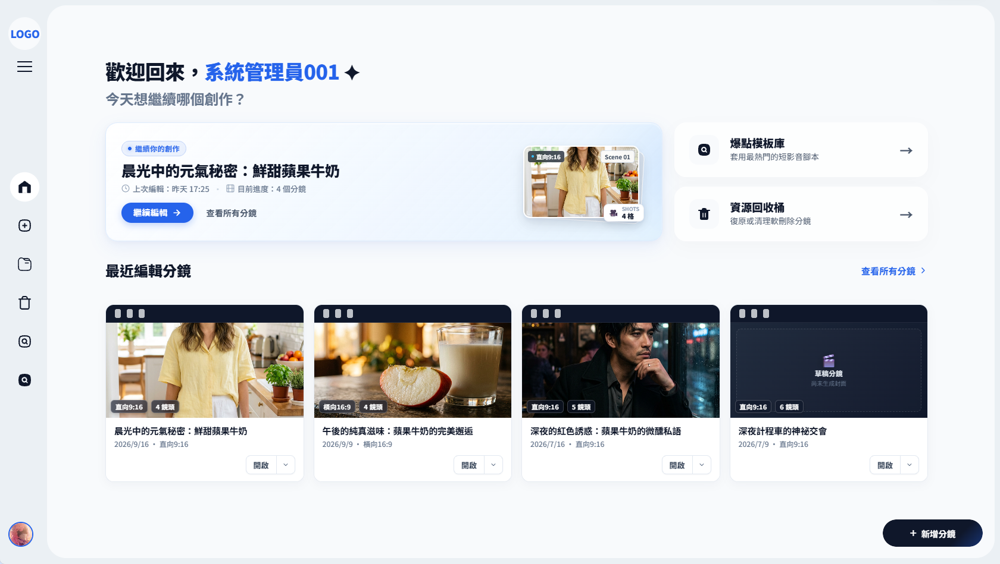
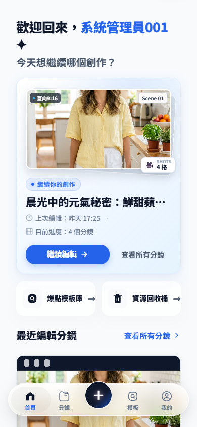
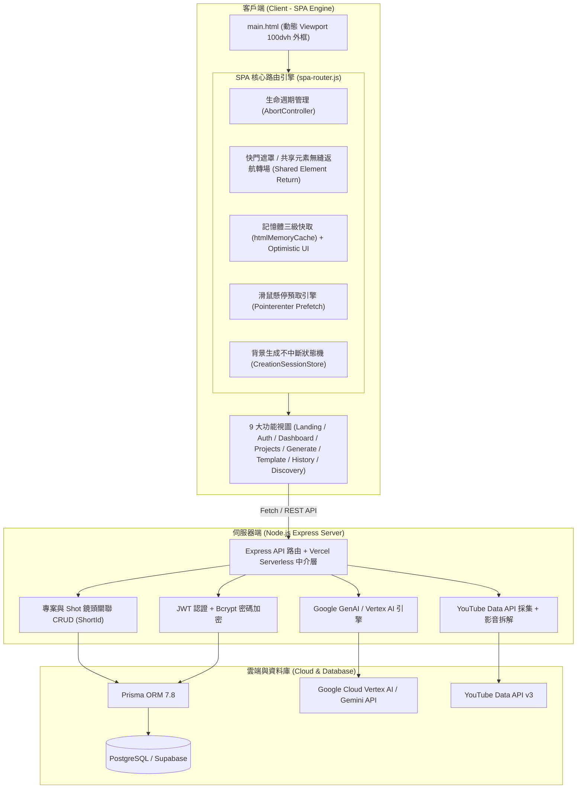
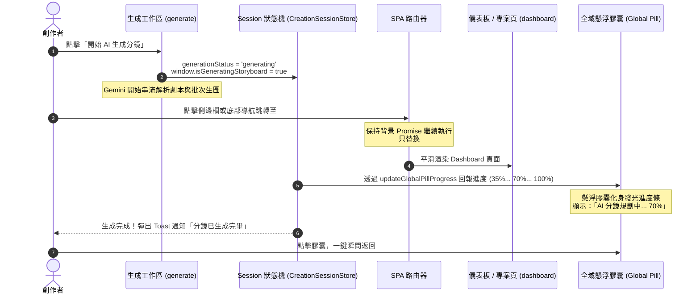
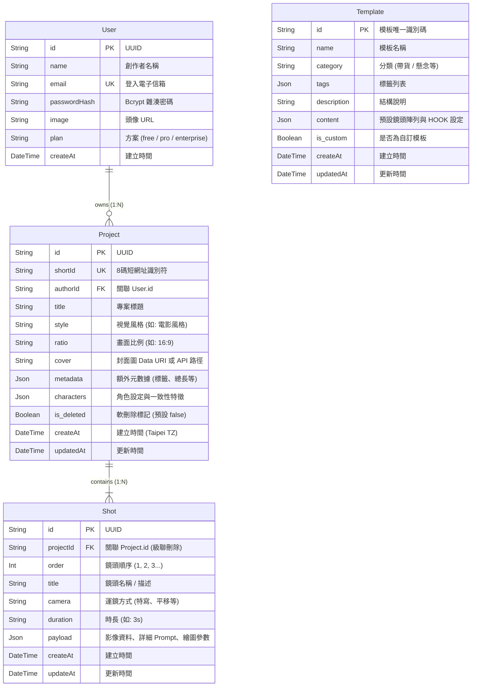

# 🎬 Storyboard AI — 智能短影音分鏡創作平台

<div align="center">


**「靈感，一鍵轉換」—— 專為新媒體創作者、導演與影視團隊打造的 AI 智能短影音分鏡創作與爆點分析系統**

<br>

<p align="center">
  
</p>

</div>

---

## 📸 系統視覺預覽 (UI Gallery & Screenshots)

<div align="center">

### 🖥️ 電腦端 (Desktop) vs 📱 手機端 (Mobile) 設計對照

<table>
  <tr>
    <th width="65%" align="center">🖥️ 電腦端主控儀表板 (Desktop Dashboard)</th>
    <th width="35%" align="center">📱 手機端立體壓克力體驗 (Mobile Experience)</th>
  </tr>
  <tr>
    <td align="center" valign="top">
      
      <br>
      <em>▲ 60px 迷你圖標側邊欄、分鏡製作資料夾 (Project Folder Card)、焦點置頂專案與全局快速創作塢</em>
    </td>
    <td align="center" valign="top">
      
      <br>
      <em>▲ 立體磨砂壓克力浮島底部導航 (Bottom Nav)、雙軌剪裁遮罩與靈動跟手回彈</em>
    </td>
  </tr>
  <tr>
    <th align="center">🎬 品牌概念落地頁 (Landing Page)</th>
    <th align="center">🔐 膠卷美學身份認證 (Auth Portal)</th>
  </tr>
  <tr>
    <td align="center" valign="top">
      
      <br>
      <em>▲ 3D 電影打板機滾動視差合攏動畫、預告片展示與「靈感，一鍵轉換」主題入口</em>
    </td>
    <td align="center" valign="top">
      
      <br>
      <em>▲ 膠卷上下雙排齒孔卡片容器、雙標籤滑動切換與密碼眼睛動態顯示</em>
    </td>
  </tr>
</table>

</div>

---

## 📑 目錄

- [一、專案簡介 (Project Overview)](#一專案簡介-project-overview)
  - [1.1 核心理念與問題背景](#11-核心理念與問題背景)
  - [1.2 系統整體架構圖](#12-系統整體架構圖)
  - [1.3 技術棧一覽 (Tech Stack)](#13-技術棧一覽-tech-stack)
- [二、跨平台設計語言與終端細節 (Desktop & Mobile Design System)](#二跨平台設計語言與終端細節-desktop--mobile-design-system)
  - [2.1 電腦端設計：分鏡製作資料夾 (Storyboard Production Folder) 與前後景實體層次](#21-電腦端設計分鏡製作資料夾-storyboard-production-folder-與前後景實體層次)
  - [2.2 手機端設計細節：立體磨砂壓克力 Bottom Nav 與靈動跟手回彈](#22-手機端設計細節立體磨砂壓克力-bottom-nav-與靈動跟手回彈)
  - [2.3 雙軌剪裁遮罩技術 (Dual-Track Clip-Path Indicator)](#23-雙軌剪裁遮罩技術-dual-track-clip-path-indicator)
  - [2.4 虛擬鍵盤避讓與 Viewport 動態適配 (`100dvh` + VisualViewport)](#24-虛擬鍵盤避讓與-viewport-動態適配-100dvh--visualviewport)
- [三、極致 SPA 路由與底層工程 (SPA Engine & Performance)](#三極致-spa-路由與底層工程-spa-engine--performance)
  - [3.1 單頁式網頁替換：背景生成不中斷 (Continuous Generation)](#31-單頁式網頁替換背景生成不中斷-continuous-generation)
  - [3.2 懸停瞬開機制：滑鼠懸停快取 (Hover Prefetching Architecture)](#32-懸停瞬開機制滑鼠懸停快取-hover-prefetching-architecture)
  - [3.3 路由切換生命週期與非同步中斷 (`AbortController`)](#33-路由切換生命週期與非同步中斷-abortcontroller)
- [四、靈動動效與數學幾何 (Fluid Motion & Math Aesthetics)](#四靈動動效與數學幾何-fluid-motion--math-aesthetics)
  - [4.1 極座標玫瑰幾何載入動畫 (Rose Curve Loader)](#41-極座標玫瑰幾何載入動畫-rose-curve-loader)
  - [4.2 快速創作塢 (Quick Compose, QC) 形變動效](#42-快速創作塢-quick-compose-qc-形變動效)
  - [4.3 專案下墜入垃圾桶與 5 秒撤銷動畫 (Drop to Trash & Undo Toast)](#43-專案下墜入垃圾桶與-5-秒撤銷動畫-drop-to-trash--undo-toast)
  - [4.4 電影快門黑幕遮罩 (Black Mask Transition) 與深景深縮放](#44-電影快門黑幕遮罩-black-mask-transition-與深景深縮放)
  - [4.5 專案卡片 Option 按鈕物理形變動態 (Solid Matte Acrylic Option Morph)](#45-專案卡片-option-按鈕物理形變動態-solid-matte-acrylic-option-morph)
  - [4.6 跨頁共享元素無縫返航轉場 (Shared Element Return Transition)](#46-跨頁共享元素無縫返航轉場-shared-element-return-transition)
  - [4.7 比例自適應面積平衡演算法 (Target Visual Area & Continuous Depth Curve)](#47-比例自適應面積平衡演算法-target-visual-area--continuous-depth-curve)
- [五、核心功能模塊 (Feature Modules)](#五核心功能模塊-feature-modules)
  - [5.1 身份認證與帳號安全模組 (Auth & Security)](#51-身份認證與帳號安全模組-auth--security)
  - [5.2 專案與分鏡管理模組 (Project & Storyboard Management)](#52-專案與分鏡管理模組-project--storyboard-management)
  - [5.3 四階段 AI 分鏡生成工作室 (AI Creation Studio & Engine)](#53-四階段-ai-分鏡生成工作室-ai-creation-studio--engine)
  - [5.4 爆點模板庫與時間軸模組 (Hook Templates & Timeline)](#54-爆點模板庫與時間軸模組-hook-templates--timeline)
  - [5.5 熱門短影音探索與拆解實驗室 (Discovery & Video Analysis Lab)](#55-熱門短影音探索與拆解實驗室-discovery--video-analysis-lab)
  - [5.6 資源回收與歷史防護 (History & Soft-Delete)](#56-資源回收與歷史防護-history--soft-delete)
- [六、頁面細分設計與基礎邏輯 (Pages Breakdown)](#六頁面細分設計與基礎邏輯-pages-breakdown)
  - [6.1 頁面 1：主外框與視窗動態適配頁 (`main.html` + `main.js`)](#61-頁面-1主外框與視窗動態適配頁-mainhtml--mainjs)
  - [6.2 頁面 2：品牌落地頁 (`index.html` + `landing.js`)](#62-頁面-2品牌落地頁-indexhtml--landingjs)
  - [6.3 頁面 3：身份認證頁面 (`login.html` + `auth.js`)](#63-頁面-3身份認證頁面-loginhtml--authjs)
  - [6.4 頁面 4：創作者主控儀表板 (`dashboard.html` + `dashboard.js`)](#64-頁面-4創作者主控儀表板-dashboardhtml--dashboardjs)
  - [6.5 頁面 5：分鏡專案庫與詳情檢視 (`projects.html`)](#65-頁面-5分鏡專案庫與詳情檢視-projectshtml)
  - [6.6 頁面 6：AI 核心分鏡生成工作區 (`generate.html` + `generate.js`)](#66-頁面-6ai-核心分鏡生成工作區-generatehtml--generatejs)
  - [6.7 頁面 7：爆點模板庫與時間軸預覽 (`template.html` + `template-timeline.js`)](#67-頁面-7爆點模板庫與時間軸預覽-templatehtml--template-timelinejs)
  - [6.8 頁面 8：資源回收桶 (`history.html`)](#68-頁面-8資源回收桶-historyhtml)
  - [6.9 頁面 9：短影音探索實驗室 (`discovery.html` + `discovery-settings.html`)](#69-頁面-9短影音探索實驗室-discoveryhtml--discovery-settingshtml)
- [七、資料庫結構與 API 規格 (Database & APIs)](#七資料庫結構與-api-規格-database--apis)
  - [7.1 Prisma Schema 實體關係圖](#71-prisma-schema-實體關係圖)
  - [7.2 核心 RESTful API 列表](#72-核心-restful-api-列表)
- [八、環境建置與部署指南 (Getting Started & Deployment)](#八環境建置與部署指南-getting-started--deployment)
  - [8.1 環境變數設定 (`.env`)](#81-環境變數設定-env)
  - [8.2 本地端啟動流程](#82-本地端啟動流程)
  - [8.3 雲端 / Vercel Serverless 部署注意事項](#83-雲端--vercel-serverless-部署注意事項)

---

## 一、專案簡介 (Project Overview)

### 1.1 核心理念與問題背景

在短影音（YouTube Shorts / TikTok / Instagram Reels）高頻競爭的時代，創作者與導演常面臨三大難題：
1. **前置劇本轉化耗時**：從文字構思到分鏡草圖往往需耗費數日，拖垮產出節奏。
2. **缺乏前 3 秒爆點 (HOOK)**：缺乏科學的短影音節奏編排，完播率與留存率難以突破。
3. **工作流割裂繁瑣**：靈感發想、腳本撰寫、運鏡設計、分鏡繪製與專案歸檔散落於不同工具。

**Storyboard AI** 結合劇本邏輯拆解、爆點模板庫與 Google 頂尖生成模型（Gemini 2.5 Flash Lite、Gemini 3.5 Flash 與 Gemini 3.1 Flash Image），提供全流程極致絲滑的單頁應用（SPA）創作環境。使用者只需提供一句靈感或一段故事，系統便會自動分析鏡頭語言（景別、運鏡、燈光、時間長度），並即時生成具備電影質感的專業分鏡劇本與高解析度畫面。

---

### 1.2 系統整體架構圖


```mermaid
flowchart TB
    subgraph Client["客戶端 (Client - SPA Engine)"]
        direction TB
        ParentShell["main.html (動態 Viewport 100dvh 外框)"]
        subgraph SPARouter["SPA 核心路由引擎 (spa-router.js)"]
            Lifecycle["生命週期管理 (AbortController)"]
            Transitions["快門遮罩 / 共享元素無縫返航轉場 (Shared Element Return)"]
            CacheLayer["記憶體三級快取 (htmlMemoryCache) + Optimistic UI"]
            HoverEngine["滑鼠懸停預取引擎 (Pointerenter Prefetch)"]
            ContinuousGen["背景生成不中斷狀態機 (CreationSessionStore)"]
        end
        Views["9 大功能視圖 (Landing / Auth / Dashboard / Projects / Generate / Template / History / Discovery)"]
    end

    subgraph Backend["伺服器端 (Node.js Express Server)"]
        direction TB
        ServerRouter["Express API 路由 + Vercel Serverless 中介層"]
        AuthService["JWT 認證 + Bcrypt 密碼加密"]
        ProjectService["專案與 Shot 鏡頭關聯 CRUD (ShortId)"]
        DiscoveryService["YouTube Data API 採集 + 影音拆解"]
        GeminiService["Google GenAI / Vertex AI 引擎"]
    end

    subgraph External["雲端與資料庫 (Cloud & Database)"]
        Postgres[(PostgreSQL / Supabase)]
        PrismaORM[Prisma ORM 7.8]
        VertexAI[Google Cloud Vertex AI / Gemini API]
        YouTubeAPI[YouTube Data API v3]
    end

    ParentShell --> SPARouter
    SPARouter --> Views
    Views -- Fetch / REST API --> ServerRouter
    ServerRouter --> AuthService
    ServerRouter --> ProjectService
    ServerRouter --> DiscoveryService
    ServerRouter --> GeminiService
    
    ProjectService --> PrismaORM --> Postgres
    AuthService --> PrismaORM
    DiscoveryService --> YouTubeAPI
    GeminiService --> VertexAI
```

---

### 1.3 技術棧一覽 (Tech Stack)

| 領域 | 技術項目 | 說明 |
| :--- | :--- | :--- |
| **前端核心** | 原生 Vanilla JavaScript (ES6+) | 零厚重框架包袱，毫秒級啟動，完全掌控 DOM 生命週期與記憶體管理 |
| **單頁路由** | 自研 SPA Router (`spa-router.js`) | Hash/History 雙向同步、動態注入 CSS/JS、多層快取與無損轉場 |
| **視圖適配** | Dynamic Viewport (`100dvh`) | 支援 iOS/Android 虛擬鍵盤彈起即時高度重算 (`VisualViewport` API) |
| **設計系統** | CSS Tokens v3.1 | 3-Layer Token 架構，Production Folder 專屬語意 Token (`--surface-folder`) |
| **物理動效** | 自研貝茲求解器 + 物理彈簧數值積分 | 牛頓迭代貝茲算子、拋物線位移、過衝回彈 (Overshoot Rebound) |
| **轉場架構** | Shared Element Return Controller | 跨頁封面抽出、中心懸停、背景換頁、目標精準落點無縫吸附 (380ms) |
| **後端核心** | Node.js + Express 5.x | RESTful API、Vercel Serverless 中介層、支援 100MB 大資料負載 |
| **資料持久化**| Prisma ORM 7.8 + PostgreSQL (`pg`) | 配合 `@prisma/adapter-pg` 連線池管理，支援 UUID 與 8 碼 ShortId |
| **身分驗證** | JWT (`jsonwebtoken`) + `bcrypt` | Bearer Token 傳輸、安全性密碼雜湊、過期自動倒退登入與快取重置 |
| **AI 模型整合**| Google GenAI SDK (`@google/genai`) | `gemini-2.5-flash-lite` (超低延遲)、`gemini-3.5-flash` (劇本拆解)、`gemini-3.1-flash-image` (1K 生圖) |
| **影音探索** | YouTube Data API v3 + 多模態分析 | 搜尋 Shorts 數據，多模態剖析前 3 秒爆點鉤子、轉場節奏與分鏡 |

---

## 二、跨平台設計語言與終端細節 (Desktop & Mobile Design System)

### 2.1 電腦端設計：分鏡製作資料夾 (Storyboard Production Folder) 與前後景實體層次

專案卡片全面演進為具有強烈專案歸屬感的 **「分鏡製作資料夾 (Storyboard Production Folder)」**，象徵「一個裝載著分鏡稿與拍攝企劃的真實公事包」，具備精緻的前後景深與實體收納層次：

```text
       [ Secondary Shot ] (次要鏡頭：背景微微傾斜探出)
              ╲
          [ Primary Cover ] (主封面：插在資料夾內部，保持專案真實比例)
             ╲
┌─────────────────────────────────┐ ── [ 3/4 Header Tab ] ── [ 1/4 Option Pill (··) ]
│                                 │
│  Updated time                   │
│  Project Title                  │
│  [4 鏡頭]  [直向 9:16]          │ ── [ Folder Front Body: var(--surface-folder) ]
└─────────────────────────────────┘
```

#### 1. 前後景立體裝配 (Z-Index Hierarchy)
- **後景 (Secondary Preview)**：$z = 1$。第二張鏡頭畫面輕微逆時針傾斜（$-3.5^\circ$），模擬文件夾內凌亂但真實的稿紙堆疊。
- **中景 (Primary Preview)**：$z = 2$。專案主要封面，以計算後的物理插入深度插在資料夾前後層之間。
- **前景 (Folder Front Shell & Tab)**：$z = 3$。淺暖米灰專屬質地（`var(--surface-folder)`），上半部 3/4 區域為檔案夾 Tab，右上方 1/4 區域巧妙嵌合雙圓點 Option 按鈕。
- **動態 Hover 抽出**：滑鼠懸停時，主要封面垂直向上滑出抽出約 36px，次要鏡頭同步展開，賦予使用者「我正在抽出分鏡稿」的互動儀式感。

#### 2. Option 按鈕與 Folder 物理同色整合
- Option 按鈕拋棄過去突兀的浮動純白方塊，改採與 Folder 本體完全同源的表面材質與外框光暈：
  - `background: var(--surface-folder)`
  - `border: 1px solid var(--surface-folder-border)`
  - 內部配置簡潔典雅的雙圓點 (`circle + circle`)
  - 展開的浮動選單則維持高透光霧面壓克力（`rgba(255, 255, 255, 0.96)`, blur 14px），確保操作浮島與實體資料夾的清晰分層。

---

### 2.2 手機端設計細節：立體磨砂壓克力 Bottom Nav 與靈動跟手回彈

在螢幕寬度 $\le 768\text{px}$ 或直式螢幕時，系統自動啟用浮動於螢幕底部的**立體磨砂壓克力浮島導航列 (Mobile Bottom Nav)**。

<p align="center">
  
</p>

#### 1. 材質工藝 (Frosted Acrylic Material Spec)
- **多層漸層底色**：
  `background: linear-gradient(180deg, rgba(255, 255, 255, 0.62) 0%, rgba(245, 245, 240, 0.45) 100%) !important;`
- **超採樣背景模糊與飽和度提升**：
  `backdrop-filter: blur(12px) saturate(125%) brightness(1.04);`
- **表面高光微反光膜 (Surface Sheen Film)**：
  透過 `::before` 偽元素注入 `linear-gradient(180deg, rgba(255, 255, 255, 0.22) 0%, rgba(255, 255, 255, 0) 55%)`。

#### 2. 靈動跟手回彈與物理彈簧 (Rubberband Physics & Spring Dynamics)
- **指尖拖曳阻尼公式**：
  $$\Delta x_{\text{render}} = \text{sign}(\Delta x) \cdot \text{maxDx} \cdot \left(1 - \frac{1}{1 + \frac{|\Delta x| \cdot 0.16}{\text{maxDx}}}\right)$$
- **方向性縱向拉伸 (Directional Vertical Stretch)**：
  $$\text{scaleY} = \text{baseScale} + \min(0.045, (|\Delta y| - 8) \times 0.0035)$$
- **離手物理彈簧數值積分 (Euler Spring Step)**：放手瞬間啟動每秒 60/120fps 微分方程迭代（$F = -kx - cv$），帶來極致的 iOS 級別過衝回彈。

---

### 2.3 雙軌剪裁遮罩技術 (Dual-Track Clip-Path Indicator)

為了解決傳統底部導航在切換圖標時「輪廓線跳動、著色滲漏」的視覺缺陷，本系統採用**雙軌動態剪裁技術**：

```
[ 底軌 Track 1: Base Track ]  ──>  放置所有未選中狀態的深色微透明輪廓線圖標 (Stroke)
               ▲
               │  動態由 JavaScript 計算的膠囊剪裁區域 (clip-path: inset round 999px)
               ▼
[ 頂軌 Track 2: Focus Track ] ──>  放置所有選中狀態的高對比純填色圖標 (Pure Fill, No Stroke)
```

- **代碼核心**：
  ```javascript
  const clipValue = `inset(${top.toFixed(2)}px ${right.toFixed(2)}px ${bottom.toFixed(2)}px ${left.toFixed(2)}px round 999px)`;
  focusTrack.style.clipPath = clipValue;
  focusTrack.style.webkitClipPath = clipValue;
  ```

---

### 2.4 虛擬鍵盤避讓與 Viewport 動態適配 (`100dvh` + VisualViewport)

行動端瀏覽器在彈出虛擬鍵盤時常引發 `100vh` 溢出與破版。專案在外框 `public/js/main.js` 實現了多重保護：
1. **動態高度綁定 (`100dvh`)**：iframe 徹底貼合可視區域。
2. **`VisualViewport` 監聽**：即時計算 `window.visualViewport.height`，動態覆寫 iframe 高度。
3. **軟鍵盤開關偵測**：高度差大於 100px 時自動在 body 上切換 `.ai-keyboard-open` 類別，連動底層表單與按鈕自動抬升。

---

## 三、極致 SPA 路由與底層工程 (SPA Engine & Performance)

### 3.1 單頁式網頁替換：背景生成不中斷 (Continuous Generation)

傳統多頁面應用（MPA）在跳轉時會銷毀 JavaScript 執行緒，導致耗時數十秒的 AI 分鏡生圖被迫中斷。**Storyboard AI 的單頁路由引擎徹底解決了此痛點**：


```mermaid
sequenceDiagram
    autonumber
    actor Creator as 創作者
    participant GenStudio as 生成工作區 (generate)
    participant Store as Session 狀態機 (CreationSessionStore)
    participant Router as SPA 路由器
    participant Dash as 儀表板 / 專案頁 (dashboard)
    participant Pill as 全域懸浮膠囊 (Global Pill)

    Creator->>GenStudio: 點擊「開始 AI 生成分鏡」
    GenStudio->>Store: generationStatus = 'generating'<br/>window.isGeneratingStoryboard = true
    Note over GenStudio: Gemini 開始串流解析劇本與批次生圖
    Creator->>Router: 點擊側邊欄或底部導航跳轉至 #/dashboard
    Note over Router: 保持背景 Promise 繼續執行<br/>只替換 #page-content 視圖，不重新整理頁面
    Router->>Dash: 平滑渲染 Dashboard 頁面
    Store->>Pill: 透過 updateGlobalPillProgress 回報進度 (35%... 70%... 100%)
    Note over Pill: 懸浮膠囊化身發光進度條<br/>顯示：「AI 分鏡規劃中... 70%」
    Store-->>Creator: 生成完成！彈出 Toast 通知「分鏡已生成完畢」
    Creator->>Pill: 點擊膠囊，一鍵瞬間返回 #/generate 檢視成果
```

---

### 3.2 懸停瞬開機制：滑鼠懸停快取 (Hover Prefetching Architecture)

1. **游標接觸感知 (`pointerenter`)**：移動至卡片或導航按鈕瞬間（比點擊早 100~300ms），即刻非同步觸發 `prefetchPage`。
2. **三級記憶體快取層**：
   - **DOM 樹快取 (`window.htmlMemoryCache`)**：快取解析完成的 DOM，免除重複網路與解析開銷。
   - **專案清單快取 (`cacheProjectsList`)**：記憶體保留最新專案陣列。
   - **鏡頭細節快取 (`cacheProjectDetails[id]`)**：背景預抓特定專案的鏡頭陣列與高畫質圖片。
3. **成果**：真正點擊時資源已在記憶體，實現零白屏瞬開。

---

### 3.3 路由切換生命週期與非同步中斷 (`AbortController`)

```javascript
if (currentNavController) {
  currentNavController.abort(); // 瞬間取消上一頁尚未完成的 fetch
}
const controller = new AbortController();
currentNavController = controller;
const signal = controller.signal;

const mySeq = ++navSeq;
if (signal.aborted || mySeq !== navSeq) return;
```

---

## 四、靈動動效與數學幾何 (Fluid Motion & Math Aesthetics)

### 4.1 極座標玫瑰幾何載入動畫 (Rose Curve Loader)

Storyboard AI 採用基於高等幾何學的**極座標玫瑰曲線（Rhodonea Curve）**動態繪製引擎：

$$\begin{cases}
r(\theta) = a \cdot \Big(\text{base} + \text{scale} \cdot \text{boost}\Big) \cdot \cos(k \cdot \theta) \\
x(\theta) = 50 + \cos(\theta) \cdot r(\theta) \cdot \text{scale} \\
y(\theta) = 50 + \sin(\theta) \cdot r(\theta) \cdot \text{scale}
\end{cases}$$

- 配合週期 4.6 秒半徑呼吸與 45 顆指數衰減物理粒子拖尾，撫平載入等待感。

---

### 4.2 快速創作塢 (Quick Compose, QC) 形變動效

點擊右下角懸浮發光膠囊，按鈕平滑擴展為寬度 680px 的全功能劇本輸入面板，行動端自動鎖定捲軸，輸入完成後點擊送出直接化身粒子流平滑轉場至 `#/generate`。

---

### 4.3 專案下墜入垃圾桶與 5 秒撤銷動畫 (Drop to Trash & Undo Toast)

點擊刪除後，卡片套用重力下墜動效並觸發樂觀 UI 移除，右下角彈出「專案已移至回收桶」全域 Toast 與「復原」按鈕，5 秒定時排程保護誤觸。

---

### 4.4 電影快門黑幕遮罩 (Black Mask Transition) 與深景深縮放

跨大模組切換時，上下兩片黑幕以 `cubic-bezier(.4, 0, .2, 1)` 對稱閉合（0.32s），徹底遮蔽 DOM 銷毀與排版重繪跳動。

---

### 4.5 專案卡片 Option 按鈕物理形變動態 (Solid Matte Acrylic Option Morph)

卡片右上角 1/4 處的雙圓點按鈕點擊後，觸發全自研的牛頓迭代三次貝茲形變展開動效：

$$\text{Option Button (36px)} \longrightarrow \text{Dot (20px)} \xrightarrow[\text{Quadratic Bézier}]{\text{Parabolic Flight}} \text{Mid-Air Expansion} \longrightarrow \text{Matte Acrylic Menu}$$

1. **反重力拋物線升力**：向上施加約 $18\text{px}$ 弧度（$P_1.y = \min(P_0.y, P_2.y) - 18\text{px}$）。
2. **飛行中舒展**：小圓於飛行至 50% 弧線時同步舒展為膠囊體，抵達目的地平滑鎖定。
3. **反向階梯融解 (Reverse Stagger & Melt)**：收合時，最底層項目以 12ms 間隔向上反向漸隱融解，小圓滑回觸發點並原地舒展重組雙圓點。

---

### 4.6 跨頁共享元素無縫返航轉場 (Shared Element Return Transition)

為解決單頁應用在進入專案詳情時「卡片封面閃爍消失、分鏡突然出現」的割裂感，系統實作了**全域 Shared Element 飛行轉場狀態機**：

```text
[ 卡片封面抽出 ] ──(40%飛行)──> [ 觸發 SPA 換頁 ]
       │                               │
       ▼                               ▼
[ 飛向畫面中央懸停 ] ──────────> [ 背景載入專案資料與鏡頭 ]
                                       │
                                       ▼
                                [ 第一鏡頭完成排版與解碼 ]
                                       │
                                       ▼
                      [ 封面自中央飛向第一鏡頭落點 (380ms) ]
                                       │
                                       ▼
                         [ 90ms 跨淡入淡出，無縫合體！ ]
```

- **架構特點**：轉場圖層獨立於 `#page-main` 之外（`#transition-layer`），跨頁 DOM 銷毀不影響飛行實體。
- **目標精確鎖定**：第一鏡頭容器預先標記 `.is-transition-target`（保留排版佔位並將 opacity 設為 0），轉場控制器經雙重 `requestAnimationFrame` 確認佈局穩定與圖片解碼完成後，精確計算落點 Rect，以 `cubic-bezier(.4, 0, .2, 1)` 飛入並完成像素級吸附。

---

### 4.7 比例自適應面積平衡演算法 (Target Visual Area & Continuous Depth Curve)

各專案封面比例多元（橫向 16:9、直向 9:16、正方 1:1、超寬 21:9 等）。若單純固定寬或高，直向封面會過於瘦小，橫向封面則會巨大無比。系統引進**目標視覺面積（Target Visual Area）演算法與平滑深度曲線**：

#### 1. 等效視覺面積守恆
$$\text{TargetArea} = W \times H \approx 19500\,\text{px}^2 \quad (\text{Compact}: 16000\,\text{px}^2)$$
$$\text{Width} = \sqrt{\text{TargetArea} \times r}, \quad \text{Height} = \sqrt{\frac{\text{TargetArea}}{r}}$$

#### 2. 連續平滑露出深度曲線
為使較矮的 16:9 封面在未 Hover 靜態下不被 36px 的資料夾 Tab 遮蔽過多，系統建立連續對數曲線：
$$\text{visibleRatio} = \text{clamp}\Big(0.46,\, 0.65,\, 0.54 - 0.05 \times \log_2(r)\Big)$$
$$\text{insertDepth} = \text{round}\Big(\text{Height} \times (1 - \text{visibleRatio}) - \text{tabHeight}\Big)$$

| 畫面比例 | 基準尺寸 ($W \times H$) | 插入深度 `insertDepth` | 靜態露出高度 | 露出比例 |
| :--- | :--- | :--- | :--- | :--- |
| **16:9 (橫式)** | 186 × 105px | **16px** | **52.7px** | **50.3%**（露出約一半，告別細縫感） |
| **21:9 (超寬)** | 213 × 91.5px | **12px** | **43.5px** | **47.5%** |
| **4:3 (標準)** | 161 × 121px | **22px** | **62.9px** | **52.0%** |
| **1:1 (正方)** | 140 × 140px | **28px** | **75.6px** | **54.0%** |
| **9:16 (直式)** | 94.5 × 168px | **28px** | **104.0px** | **61.9%** |

---

## 五、核心功能模塊 (Feature Modules)

### 5.1 身份認證與帳號安全模組 (Auth & Security)
- **無縫 JWT 鑑權體系**：使用標準 `Bearer` 標頭進行跨請求認證，封裝於 `window.spaAuth`。
- **無感狀態校驗 (`/api/auth/me`)**：每次切換受保護頁面時背景驗證 Token，過期自動平滑倒退至登入頁。
- **快取聯動清除**：登出時清除 `localStorage` 快取、終止所有排程佇列並重設記憶體快取。

### 5.2 專案與分鏡管理模組 (Project & Storyboard Management)
- **短網址識別 (`shortId`)**：8 碼短網址識別符，兼顧安全不易猜測與分享便捷度。
- **專案複製 (Duplicate)**：一鍵複製專案及底下所有鏡頭配置與秒數。
- **分鏡製作資料夾視覺**：支援即時搜尋、自適應比例封面呈現與拖曳/點擊無縫導航。

### 5.3 四階段 AI 分鏡生成工作室 (AI Creation Studio & Engine)
- **Phase 1: 故事輸入與意圖啟動**：支援長文本，智慧預選合適風格。
- **Phase 2: 視覺調性與畫幅比例確立**：8 種精選風格，支援 16:9, 9:16, 1:1, 3:2, 2:3。
- **Phase 3: 爆點 HOOK 模板推薦與注入**：結合前 3 秒留存公式。
- **Phase 4: 多模態分鏡編排與即時繪製**：由 `gemini-3.5-flash` 拆解劇本，`gemini-3.1-flash-image` 渲染精美 1K 分鏡圖。

### 5.4 爆點模板庫與時間軸模組 (Hook Templates & Timeline)
- 結構化短影音爆款公式，可視化時間軸標記鏡頭節奏，一鍵帶入參數前往生成。

### 5.5 熱門短影音探索與拆解實驗室 (Discovery & Video Analysis Lab)
- YouTube Shorts 數據採集，Gemini 多模態影片分析轉場與爆紅文案。

### 5.6 資源回收與歷史防護 (History & Soft-Delete)
- 安全軟刪除 (`is_deleted = true`)，支援單一還原、批次還原與永久清空。

---

## 六、頁面細分設計與基礎邏輯 (Pages Breakdown)

### 6.1 頁面 1：主外框與視窗動態適配頁 (`main.html` + `main.js`)
- 單一 Viewport 容器，防止雙捲軸，監聽 `visualViewport.resize` 動態重算高度。

### 6.2 頁面 2：品牌落地頁 (`index.html` + `landing.js`)
- 3D 電影打板機視差合攏動畫（GSAP 控制），概念預告片，CTA 攔截快門轉場。

### 6.3 頁面 3：身份認證頁面 (`login.html` + `auth.js`)
- 左右雙向滑動卡片切換、密碼顯示隱藏、膠卷齒孔卡片容器。

### 6.4 頁面 4：創作者主控儀表板 (`dashboard.html` + `dashboard.js`)
- 焦點專案置頂卡片、分鏡製作資料夾網格、自適應比例封面抽出預覽、快速創作塢。

### 6.5 頁面 5：分鏡專案庫與詳情檢視 (`projects.html`)
- 完整專案資料夾卡片陣列，點擊卡片觸發 Shared Element Return 飛行轉場進入專案詳情；右上角 Option 按鈕展開立體壓克力選單。

### 6.6 頁面 6：AI 核心分鏡生成工作區 (`generate.html` + `generate.js`)
- `CreationSessionStore` 狀態驅動，支援背景不中斷生圖與單鏡頭重繪。

### 6.7 頁面 7：爆點模板庫與時間軸預覽 (`template.html` + `template-timeline.js`)
- 模板分類標籤與可視化時間軸彈窗。

### 6.8 頁面 8：資源回收桶 (`history.html`)
- 軟刪除專案列表，支援還原與徹底清理。

### 6.9 頁面 9：短影音探索實驗室 (`discovery.html` + `discovery-settings.html`)
- YouTube Shorts 搜尋與多模態爆點分析報告。

---

## 七、資料庫結構與 API 規格 (Database & APIs)

### 7.1 Prisma Schema 實體關係圖


```mermaid
erDiagram
    User ||--o{ Project : "owns (1:N)"
    Project ||--|{ Shot : "contains (1:N)"
    
    User {
        String id PK "UUID"
        String name "創作者名稱"
        String email UK "登入電子信箱"
        String passwordHash "Bcrypt 雜湊密碼"
        String image "頭像 URL"
        String plan "方案 (free / pro / enterprise)"
        DateTime createAt "建立時間"
    }

    Project {
        String id PK "UUID"
        String shortId UK "8碼短網址識別符"
        String authorId FK "關聯 User.id"
        String title "專案標題"
        String style "視覺風格 (如: 電影風格)"
        String ratio "畫面比例 (如: 16:9)"
        String cover "封面圖 Data URI 或 API 路徑"
        Json metadata "額外元數據 (標籤、總長等)"
        Json characters "角色設定與一致性特徵"
        Boolean is_deleted "軟刪除標記 (預設 false)"
        DateTime createAt "建立時間 (Taipei TZ)"
        DateTime updatedAt "更新時間"
    }

    Shot {
        String id PK "UUID"
        String projectId FK "關聯 Project.id (級聯刪除)"
        Int order "鏡頭順序 (1, 2, 3...)"
        String title "鏡頭名稱 / 描述"
        String camera "運鏡方式 (特寫、平移等)"
        String duration "時長 (如: 3s)"
        Json payload "影像資料、詳細 Prompt、繪圖參數"
        DateTime createAt "建立時間"
        DateTime updateAt "更新時間"
    }

    Template {
        String id PK "模板唯一識別碼"
        String name "模板名稱"
        String category "分類 (帶貨 / 懸念等)"
        Json tags "標籤列表"
        String description "結構說明"
        Json content "預設鏡頭陣列與 HOOK 設定"
        Boolean is_custom "是否為自訂模板"
        DateTime createAt "建立時間"
        DateTime updatedAt "更新時間"
    }
```

---

### 7.2 核心 RESTful API 列表

| 方法 | 路徑 | 授權要求 | 功能描述 |
| :--- | :--- | :--- | :--- |
| `POST` | `/api/auth/register` | 免 | 註冊新帳號，密碼經由 `bcrypt` 加密儲存 |
| `POST` | `/api/auth/login` | 免 | 帳號密碼登入，驗證成功後簽發 JWT Token |
| `GET` | `/api/auth/me` | Bearer Token | 取得當前登入者資訊，校驗 Token 有效性 |
| `POST` | `/api/auth/logout` | 免 | 登出並使客戶端 Token 失效 |
| `GET` | `/api/projects` | Bearer Token | 獲取專案清單（支援 `?include_deleted=true`） |
| `POST` | `/api/projects` | Bearer Token | 建立新專案並批次寫入底下所有鏡頭 (`shots`) |
| `GET` | `/api/projects/:id` | Bearer Token | 獲取單一專案完整資料（含鏡頭與作者資訊） |
| `DELETE`| `/api/projects/:id` | Bearer Token | 軟刪除指定專案（標記 `is_deleted = true`） |
| `POST` | `/api/projects/:id/restore` | Bearer Token | 從回收桶還原專案 |
| `POST` | `/api/projects/:id/duplicate` | Bearer Token | 完整複製既有專案成為全新副本 |
| `POST` | `/api/ask-gemini` | 免 / 內部呼叫 | 呼叫 Gemini 模型進行劇本解析 (`story`) 或生圖 (`image`) |
| `GET` | `/api/get-templates` | 免 | 獲取爆點短影音模板清單 |
| `POST` | `/api/discovery/search` | 免 / Cookie | 搜尋熱門 YouTube Shorts 影片 |
| `POST` | `/api/discovery/analyze` | 免 / Cookie | 透過 Gemini 多模態分析指定影片的爆款結構 |

---

## 八、環境建置與部署指南 (Getting Started & Deployment)

### 8.1 環境變數設定 (`.env`)

請在專案根目錄下建立 `.env` 檔案，填入以下參數：

```ini
# 伺服器監聽埠號
PORT=3000

# 資料庫連線字串 (PostgreSQL / Supabase Transaction Connection Pooling)
DATABASE_URL="postgresql://postgres:[PASSWORD]@[HOST]:[PORT]/[DATABASE]?pgbouncer=true"

# JWT 簽名金鑰
JWT_SECRET="your-super-secret-jwt-key"

# Google Cloud / Vertex AI 設定 (生圖與劇本生成)
GOOGLE_CLOUD_PROJECT_ID="your-gcp-project-id"

# 認證方式 A (本地開發): 指定 GCP 服務帳戶 JSON 金鑰路徑
GOOGLE_APPLICATION_CREDENTIALS="./application_default_credentials.json"

# 認證方式 B (雲端部屬/Vercel): Base64 編碼的 GCP 服務帳戶 JSON
# GCP_SERVICE_ACCOUNT_BASE64="eyJrZXlfaWQiOi..."

# 短影音探索實驗室 (可選)
YOUTUBE_API_KEY="your-youtube-data-api-key"
DISCOVERY_SETTINGS_SECRET="your-discovery-secret-32-chars"
```

> [!IMPORTANT]
> 若在本地環境執行，請務必確認 `.env` 中的 `GOOGLE_APPLICATION_CREDENTIALS` 檔案路徑正確，否則 Gemini 影像生成與 Vertex AI 調用將無法通過認證。

---

### 8.2 本地端啟動流程

1. **安裝相依套件**：
   ```bash
   npm install
   ```

2. **同步 Prisma 資料庫結構並生成 Client**：
   ```bash
   npx prisma db push
   npx prisma generate
   ```

3. **匯入預設爆款模板資料 (選用)**：
   ```bash
   npx tsx importProject.ts
   ```

4. **啟動伺服器**：
   ```bash
   npm start
   # 或使用開發自動重載模式
   node server.js
   ```

5. **瀏覽專案**：
   開啟瀏覽器造訪 `http://localhost:3000` 即可進入主頁面。

---

### 8.3 雲端 / Vercel Serverless 部署注意事項

1. **靜態檔案與 API 重寫**：專案根目錄已包含 `vercel.json`，負責將靜態資源指向 `public/`，其餘 API 請求轉發至 `server.js`。
2. **Serverless 相容性中介層**：`server.js` 內建專用中介層，自動解析 `x-matched-path` 與 `x-forwarded-uri`，防止 Vercel 路徑重寫導致 `/api` 前綴遺失。
3. **無伺服器金鑰解析**：在 Vercel 設定 `GCP_SERVICE_ACCOUNT_BASE64`，伺服器啟動時自動解碼並寫入 `/tmp/gcp-key.json`。
4. **PostgreSQL 連線池管理**：針對 Serverless 環境，`pg.Pool` 配置了 `idleTimeoutMillis: 10000` 與 `keepAlive: true`，有效預防死連線佔用。

---

<div align="center">

**Storyboard AI — 讓每個好故事，都有震撼人心的視覺表達 🎬✨**

*Made with passion for visual creators and film directors.*

</div>
